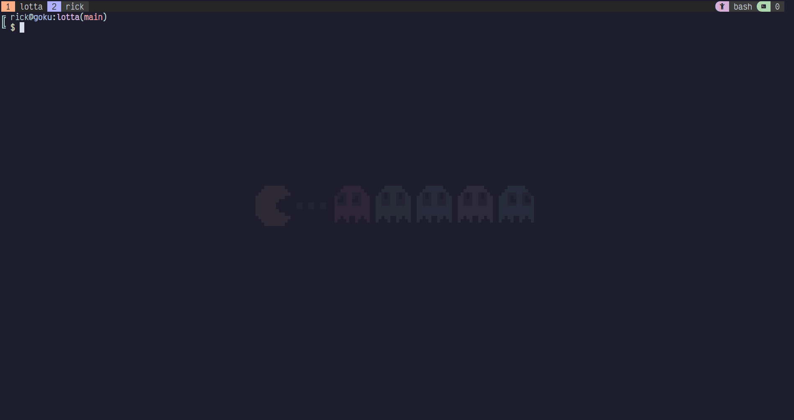
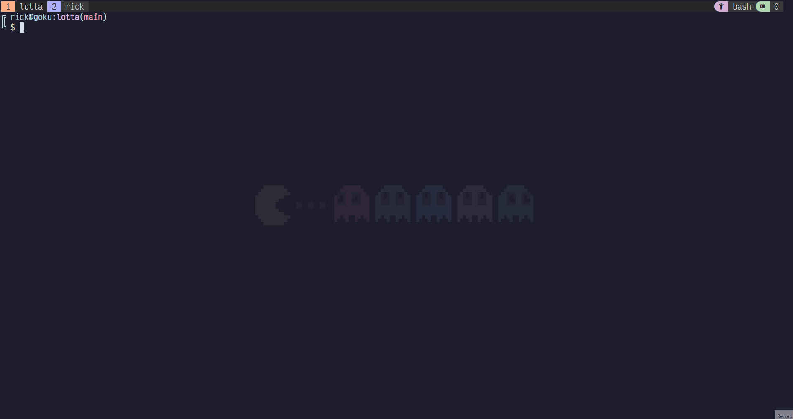

# Lotta Command Palette
	 __      ______  ______ ______ ______
	/\ \    /\  __ \/\__  _/\__  _/\  __ \
	\ \ \___\ \ \/\ \/_/\ \\/_/\ \\ \  __ \
	 \ \_____\ \_____\ \ \_\  \ \_\\ \_\ \_\
	  \/_____/\/_____/  \/_/   \/_/ \/_/\/_/
	========================================
	             Command Palette

Lotta is a command pallette that uses golang patterns.




## Install

Using golang
```
go install github.com/rickKoch/lotta
```

Using makefile
```
make && make install
```